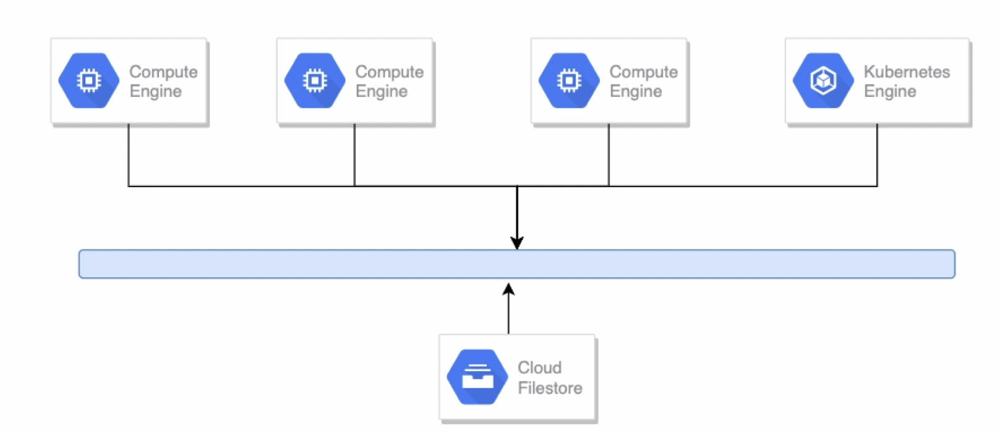
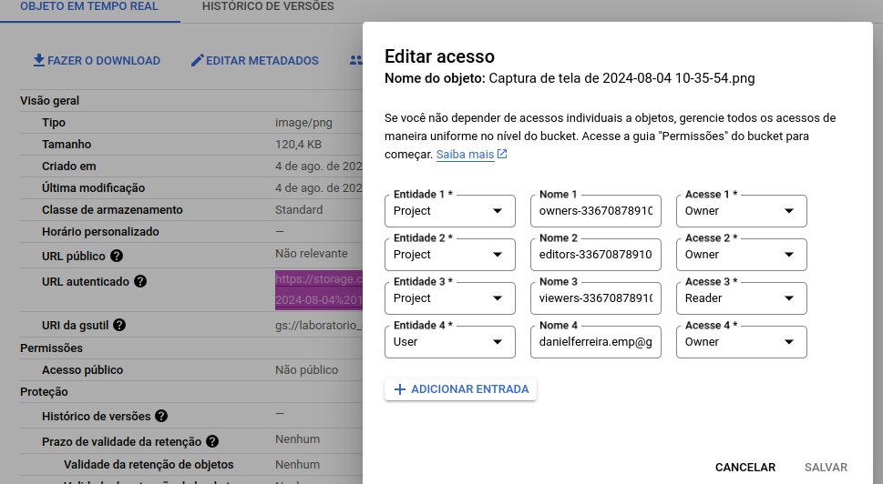
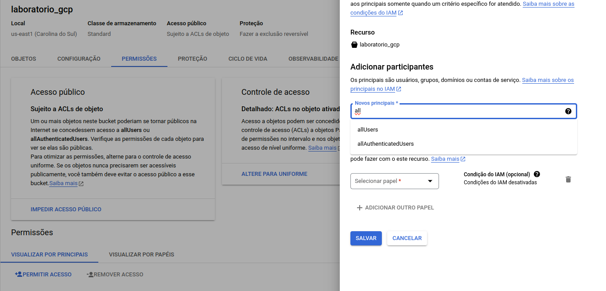

### Armazenamento

por objeto: faz o armazenamento como um todo
exemplo: upload da foto, video como um todo..

armazenamento em bloco: 
exemplo: faz operações em blocos especificos do objeto -> disco do sistema operacional


#### Cloud storage
armazenamento de objetos, tipo s3 e azure armazenamento
ideal para objeto statico, fotos, videos e etc

multiregional, regional
nearline: acessar apenas uma vez por mes, usado para backup, custo alto para recuperar
cldline: acesso apenas 1 vez no ano, dados legais, desastre e recuperação

consegue fazer o gerenciamento e ir passando o arquivo para outra classe de armazenamento

politica de acesso:
gerenciamento de identidade (iam), permite o controle de acesso ao bucket
lista de controle de acesso (acl), permite configurar acesso em objeto individuais dentro do bucket
url assinadas, permite acesso de leitura ou escrita com limite de tempo a um objeto de uma url

objetos podem ser versionados ou nao

politicas de retenção, exemplo 30 dias

pagamento pelo solicitante: permite que o custo de acesso de objetos e transferencia sejam pagos para quem está requisitando.

#### Cloud storage for firebase
armazenamento de objetos, dentro da suite de produtos firebase para desenvolvimento
gerenciado para console do firebase

#### Persistent disc
armazenamento em blocos, quando cria uma maquina virtual
permite snapshot

#### Cloud filestore - NAS
armazenamento de arquivos, NFS
varias maquinas LINUX que compartilham um determinado disco

baixa latencia, interagido com vm e bubernetes engine
minimo 1TB o maximo é 63TB

arquitetura:



#### Utilizando o bucket

Para conceder permissões a outros usuários, acesse ->


Para permitira acesso publico ->
lembre-se de remover a prevenção de acesso público


a url do objeto publico fica aqui ->


#### Comandos Gsutil

verificar o conteudo
```bash
gsutil ls gs://bd-lab-gcp
```

copiar algo para bucket
```bash
gsutil cp <arquivo> gs://bd-lab-gcp
```

remover arquivos
```bash
gsutil rm gs://bd-lab-gcp/*
gsutil rm gs://bd-lab-gcp/**
gsutil rm gs://bd-lab-gcp/<arquivo>
```