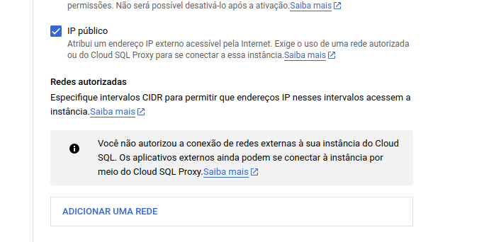

### Cloud SQL

Na criação do banco, se atente sobre as redes autorizadas, pois irá rpecisar especificar a rede para acessa-lo



conecte com o dbeaver..

para criar um banco e tabelas:

```sql
create database meusdados;

CREATE TABLE tova (
    id SERIAL PRIMARY KEY,
    nome VARCHAR(255) NOT NULL,
    numero INT NOT NULL
);

INSERT INTO tova (nome, numero) VALUES ('João', 1);
INSERT INTO tova (nome, numero) VALUES ('Maria', 2);
```

para visualizar:

```sql
select * from tova t
```